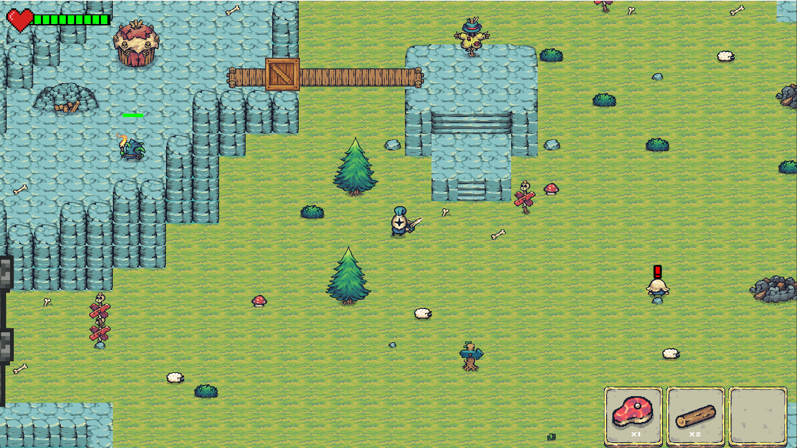

# Knight's Legacy

**Knight's Legacy** is a 2D action-RPG developed in **C++** using the **SFML** library. The project focuses on core RPG mechanics, a dynamic combat system, and map exploration.

## Screenshots

## Key Features
**Advanced Physics & Collisions:** A custom-built collision detection and interaction system.
* **Smart Enemy AI:** Enemies feature state-machine logic (IDLE, WALKING, ATTACKING, DEAD) and intelligently track the player.
* **Interactive Buildings:** Construction system with progress bars (visualized over the worker's head).
* **Dynamic Resources:**
    * **Trees:** Harvestable wood that regenerates over time.
    * **Sheep:** Reactive animals that flee upon taking damage.
    * **Gold Mines:** Require reconstruction before they start generating resources periodically.
* **Dialogue System:** State-driven dialogue boxes with a "typewriter effect" (letter-by-letter) for an immersive RPG experience.
* **Character Customization:** Choose your knight's color and enter a custom nickname.
* **Ranking System:** Performance tracking saved to `.txt` files with a Top Players leaderboard display.

## Technology Stack
* **Language:** C++20 (utilizing `std::ranges` and `std::filesystem`)
* **Graphics Library:** SFML 2.6.2
* **IDE:** Visual Studio 2022

## How to Run
The project is configured to run out of the box without downloading extra dependencies:
1. **Clone the repository:** `git clone https://github.com/Wojtek4321/Knights-Legacy.git`

## Credits & Assets
Graphics: Tiny Swords by Pixel Frog (CC0 Licensed)(https://pixelfrog-assets.itch.io/tiny-swords).
Fonts: SMW Text 2 NC.

Developed for educational purposes.
